# Random Words Architecture And Data Flows

This document describes the architecture of Random Words, the major runtime components, the build-time data pipeline, and the data flows used for generation, semantic expansion, persistence, sharing, export, and deployment.

Random Words is intentionally built as a static browser application. There is no application server at runtime. The app ships a generated SQLite database as a static asset, prefers a gzip-compressed copy for faster static hosting downloads, loads it in the browser with `sql.js`, and optionally calls Datamuse directly from the browser for theme expansion and definitions.

## System Overview

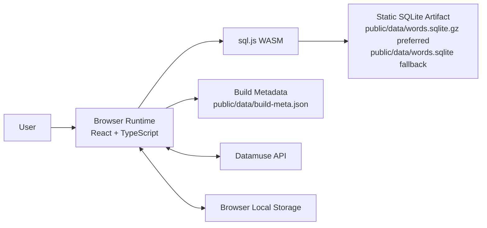

The core design choices are:

- **Static hosting:** GitHub Pages can serve the entire app.
- **Prebuilt word database:** expensive normalization and scoring happen at build time, not in the user's browser.
- **Browser-side querying:** `sql.js` lets the app filter a SQLite artifact locally.
- **Optional live semantics:** Datamuse is used only when a theme or definition lookup is needed.
- **Local-first persistence:** saved sets, history, current filters, and caches stay in browser local storage.

## Source Map

| Area | Main Files | Responsibility |
| --- | --- | --- |
| App shell and UI | `src/App.tsx`, `src/styles.css` | React state, controls, views, modals, sharing, exporting, local persistence |
| Static DB loading and filtering | `src/data.ts`, `src/services/filterEvaluator.ts` | Load compressed `words.sqlite.gz` with raw SQLite fallback, load build metadata, translate broad filters into SQL queries, apply shared client-side filters |
| Semantic and definition lookup | `src/datamuse.ts`, `src/services/filterEvaluator.ts` | Datamuse requests, semantic mode mapping, shared client-side semantic filtering, local cache |
| Generation algorithm | `src/generator.ts` | Seeded random generation, semantic/base pool blending, quality weighting, duplicate-family reduction |
| Runtime safety metadata | `src/services/safetyMetadata.ts`, `src/generated/safety-metadata.json` | Use generated offensive-word and acronym/initialism metadata in runtime filters |
| Shared types | `src/types.ts` | Filter, word, saved set, collection, metadata, semantic mode, quality mode definitions |
| DB preprocessing | `scripts/write-runtime-safety.mjs`, `scripts/build-db.mjs` | Generate compact runtime safety metadata, download wordlists, normalize entries, infer metadata, build SQLite artifact and build metadata |
| DB auditing | `scripts/audit-db.mjs` | Inspect generated database quality buckets and targeted watchlists |
| WASM copying | `scripts/copy-sql-wasm.mjs` | Copy `sql.js` WASM into `public/` for Vite/GitHub Pages |
| Unit tests | `tests/*.test.ts`, `vitest.config.ts` | Fast coverage for extracted services, shared filter semantics, and import/export behavior |
| Smoke tests | `tests/smoke.spec.ts` | Browser-level coverage for load, generation, POS filtering, sharing |
| Deployment | `.github/workflows/pages.yml`, `vite.config.ts` | GitHub Pages workflow and base path behavior |
| User documentation | `docs/user-manual.md` | User-facing operation guide |

## Build-Time Data Pipeline

The build-time pipeline converts external SCOWL/ESDB wordlists plus curated quality metadata into a normalized SQLite database.

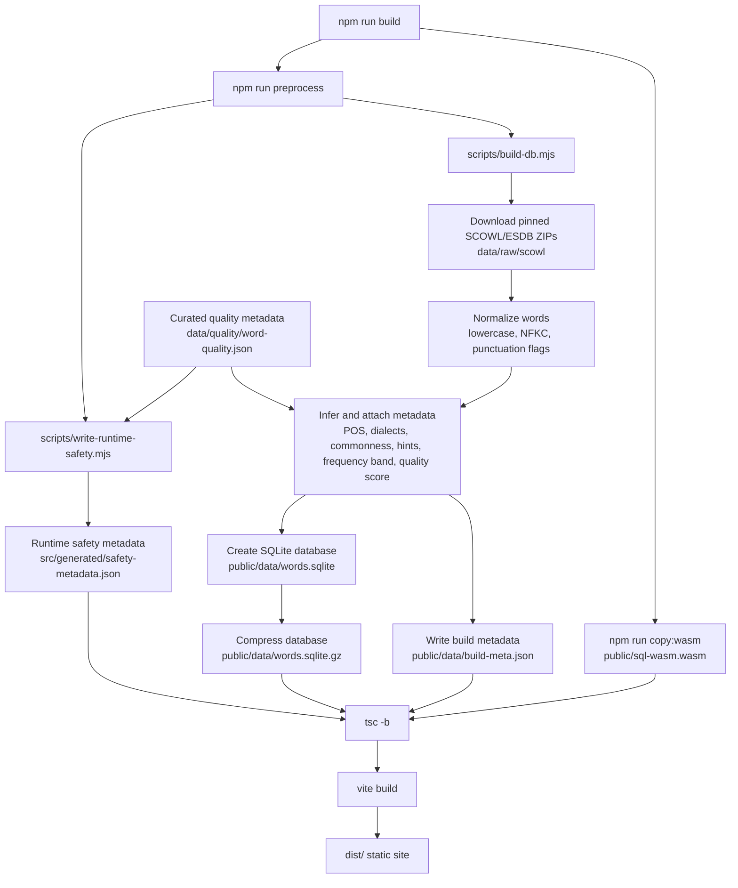

### Inputs

The primary external source is SCOWL/ESDB version `2026.02.25`, downloaded by `scripts/build-db.mjs`.

The curated local source is `data/quality/word-quality.json`, which contains:

- `posOverrides`
- `properNounHints`
- `offensiveWords`
- `acronymWords`
- `frequencyBands`

`scripts/write-runtime-safety.mjs` converts the offensive-word and acronym/initialism lists into `src/generated/safety-metadata.json`. Runtime code reads that generated artifact through `src/services/safetyMetadata.ts`, so the build pipeline and browser filters use the same curated safety source instead of maintaining duplicate hard-coded lists.

### Normalization

Each raw word entry is cleaned and normalized. The normalized database key is lowercase and NFKC-normalized. The build also records structural flags:

- Length in letters
- Apostrophe presence
- Hyphen presence
- Phrase status
- Dialect coverage
- Common or rare source tier

### Metadata Enrichment

`scripts/build-db.mjs` enriches each normalized entry with:

- Part of speech, using curated overrides first and suffix heuristics second
- Proper noun hint
- Offensive-word hint
- Acronym or initialism hint
- Frequency band: `core`, `familiar`, `standard`, or `niche`
- Quality score from 1 to 100
- Dialect coverage flags for US, GB, CA, and AU

### SQLite Schema

The generated `words` table contains one row per normalized word. Key columns include:

- `word`
- `normalized`
- `length`
- `commonness`
- `pos`
- `alternate_pos`
- `base_form`
- `pos_source`
- `pos_confidence`
- `is_phrase`
- `has_apostrophe`
- `has_hyphen`
- `proper_noun_hint`
- `offensive_hint`
- `acronym_hint`
- `frequency_band`
- `quality_score`
- `dialect_us`, `dialect_gb`, `dialect_ca`, `dialect_au`
- `source`

Indexes are created for common filtering paths:

- Length
- Commonness
- Part of speech
- Alternate part of speech
- POS source and confidence
- Quality score
- Shape flags
- Dialect flags

## Runtime Application Architecture

At runtime, the app is a React single-page application.

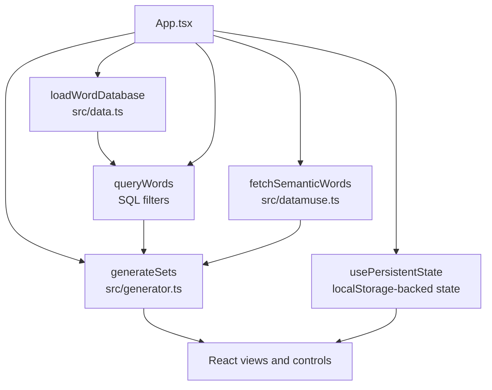

### Main React State

`src/App.tsx` owns the application state:

- `view`
- `wordDb`
- `filters`
- `displaySettings`
- `basePool`
- `semanticPool`
- `sets`
- `history`
- `savedSets`
- `collections`
- `exportFormat`
- `definitions`
- `status`
- `toast`
- `isGenerating`
- `systemPrefersDark`
- `activeUiTheme`

Most user-facing state is persisted through `usePersistentState`, which writes JSON to local storage.

### View Model

The app has six top-level views:

- `generator`
- `saved`
- `collections`
- `diagnostics`
- `about`
- `manual`

The generator view contains three functional panels:

- Criteria panel
- Generated word sets panel
- Theme, semantics, and history panel

### UI Theme Flow

The UI theme system is runtime-only and does not affect generation, exports, or share links. Theme choice is stored as part of `displaySettings`.

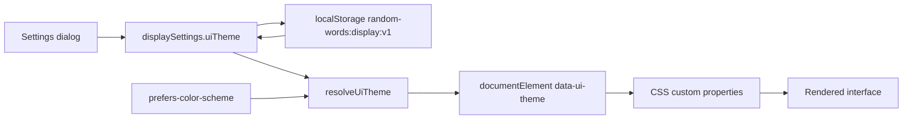

Supported stored theme values are `system`, `light`, `dark`, `high-contrast`, `ink`, `forest`, `ocean`, `sunrise`, `solar-light`, and `solar-dark`. The stored `system` value resolves at runtime to either `light` or `dark`.

## Filter And Query Flow

The local database query flow is centered on `queryWords` in `src/data.ts`.

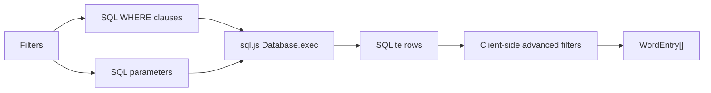

The base query always applies:

- Length range
- Non-phrase local DB entries
- Selected dialect

Optional filters apply:

- Common-only unless `includeRare` is enabled
- Part-of-speech restrictions
- Starts with
- Ends with
- Contains all letters
- Excludes any letters
- Word pattern, applied client-side with `*` and `?` wildcards
- Approximate syllable range, applied client-side with vowel-group estimation
- No contractions
- No hyphenated words
- No proper nouns
- No acronyms or initialisms
- Exclude offensive words

The SQL result is ordered by `quality_score DESC, word`, then converted into `WordEntry[]`. Pattern and syllable filters are applied after SQL conversion because they use app-level matching logic rather than database columns.

The shared `src/services/filterEvaluator.ts` module owns client-side entry filtering for both local database rows and Datamuse rows. It returns an `ok` flag plus a stable rejection reason, which keeps static and semantic filtering aligned and gives diagnostics future access to explanations such as pattern, syllable, POS, acronym, or safety rejection.

## Semantic Expansion Flow

Semantic expansion is optional. It only runs when `filters.theme.trim()` is non-empty.

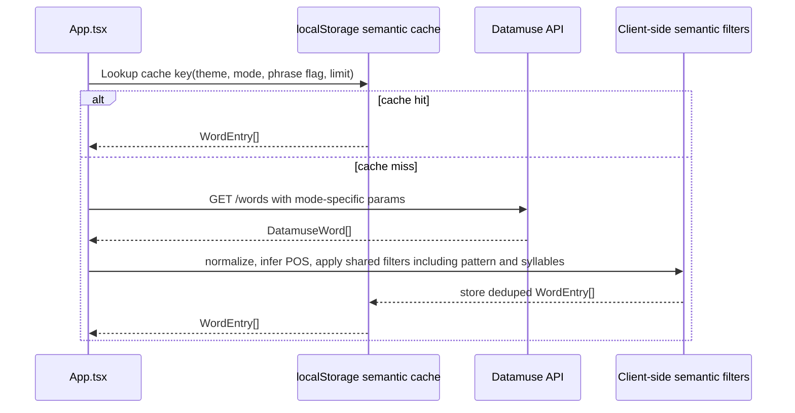

### Semantic Cache Key

`src/datamuse.ts` uses a cache key composed from:

- Lowercased theme
- Semantic mode
- Phrase inclusion flag
- Semantic candidate limit

The cache is stored under `random-words:datamuse-cache:v5`. Cached semantic entries are still passed through the shared filter evaluator on read, so changed filters or safety metadata are enforced even when Datamuse results came from local storage.

### Semantic Modes

Semantic modes map to Datamuse parameters and client-side filtering:

| Mode | Query Behavior | Additional Client Filtering |
| --- | --- | --- |
| `strict` | Meaning-like query, no extra topics | General fallback behavior is handled later in generation |
| `broad` | Meaning-like query plus theme topics | None |
| `related` | Meaning-like query plus theme topics | Semantic pool receives heavier weighting during generation |
| `mood` | Trigger association query | None |
| `evocative` | Trigger association query plus theme topics | None |
| `concrete` | Meaning-like query expanded with object/place/material terms | Keep semantic entries tagged as nouns |
| `actions` | Meaning-like query expanded with action/motion terms | Keep semantic entries tagged as verbs |
| `sensory` | Meaning-like query expanded with sensory terms | None |

Semantic entries are normalized into the same `WordEntry` shape as database rows, then passed through the same filter evaluator used by local database entries. Semantic-mode-specific restrictions, such as noun-only concrete results and verb-only action results, are enabled through evaluator options rather than duplicated in Datamuse-specific code.

## Generation Flow

Generation happens in `src/generator.ts`.

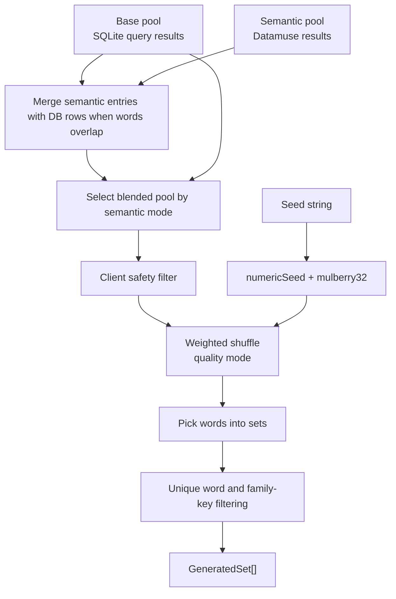

### Seed Behavior

Generation uses `numericSeed` and `mulberry32` for deterministic pseudo-randomness.

If reproducible seed mode is disabled, `prepareGenerationFilters` replaces the seed with a fresh random seed before generation. This keeps regular users from having to change seeds manually.

If reproducible seed mode is enabled, the visible seed is used directly.

### Pool Blending

`selectPool` blends local and semantic pools based on semantic mode:

- No theme: use only the base pool
- Strict: use semantic pool when available, otherwise fallback
- Related, concrete, actions, sensory: weight semantic matches more strongly
- Mood and evocative: blend semantic matches with the fallback pool
- Broad: blend semantic matches with the fallback pool, but leave more space for general words

### Quality Weighting

`weightedShuffle` ranks candidates using a random draw divided by quality weight. Better weighted entries have a higher chance of appearing earlier.

Quality mode changes the weight curve:

- `balanced`: default quality weighting
- `common`: strong preference for high quality scores
- `surprising`: weaker quality weighting for more variety

When rare words are included, weighting is softened so rare entries have a better chance to appear.

### Duplicate And Family Reduction

When `uniqueWords` is enabled, generation avoids:

- Exact duplicate words
- Same-family words with a simple root key, such as plural and common inflected forms

This is implemented with local and global sets:

- `localUsed`
- `globalUsed`
- `localRoots`
- `globalRoots`

## Definitions Flow

Definitions are loaded after sets are visible.

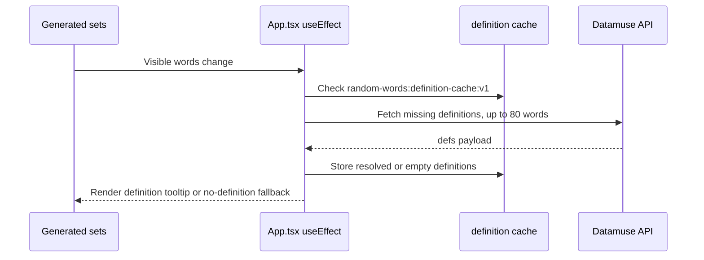

Definition requests use Datamuse with `sp`, `qe=sp`, and `md=d`. Results are cached under `random-words:definition-cache:v1`. Empty definition results are cached too, so the tile tooltip can consistently show a no-definition fallback plus word provenance instead of appearing broken or missing.

## Persistence Model

The app uses browser local storage for user state and caches. There is no remote account, database, or backend persistence.

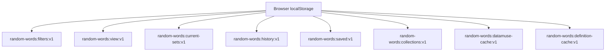

### Persisted User State

Persisted state includes:

- Current view
- Current filters
- Current generated sets
- Generation history
- Saved sets
- Collections
- Display settings, including UI theme and word details preference

### Persisted Caches

Persisted caches include:

- Semantic result cache
- Definition cache

The settings modal exposes controls for UI theme and word detail display, plus actions for clearing semantic caches and workspace data.

## Share Link Flow

Share links serialize criteria into a URL parameter. They do not serialize generated results.

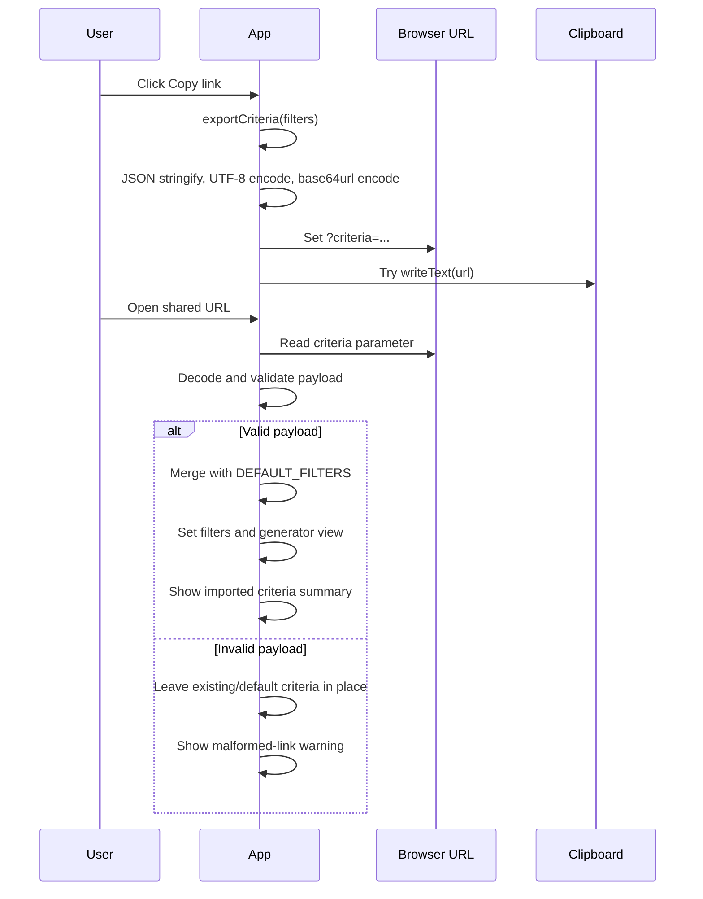

### Share Payload Validation

`normalizeSharedFilters` validates the decoded object before using it:

- Numbers are bounded
- Booleans must be booleans
- Strings must be strings
- Part-of-speech values must be known
- Dialect, semantic mode, and quality mode must be known
- Duplicate mode must be known
- Missing values fall back to defaults

This makes older links safer to handle. Invalid or undecodable payloads are rejected as a whole, reported to the user, and not applied as partial criteria.

## Export Flow

Exporting converts the visible sets plus active criteria into one of three formats. Result exports use `serializeSets`; diagnostics exports use `serializeDiagnostics`.

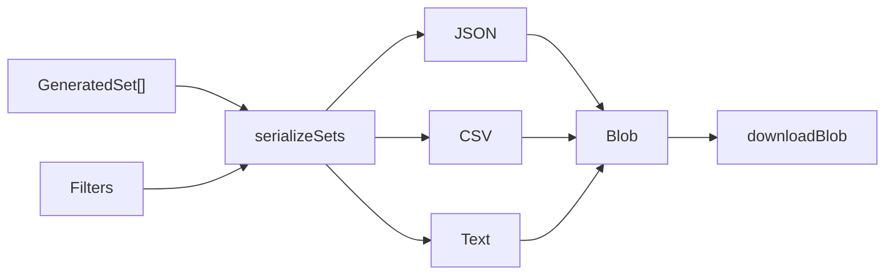

Result exports include:

- Export timestamp
- Criteria metadata
- Generated sets
- Word-level metadata where the format supports it

CSV includes columns for set, position, word, part of speech, frequency band, quality score, source, theme, semantic mode, quality mode, seed mode, and seed.

Diagnostics export uses the same `ExportFormat` options. It serializes the currently visible diagnostics rows after diagnostics search and row-filter controls have been applied.

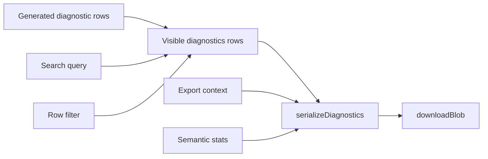

Diagnostics exports include the export timestamp, row filter, search query, criteria metadata, semantic summary counts, and row-level provenance such as POS source, POS confidence, frequency band, quality score, source, semantic score, semantic strength, and semantic source.

## Saved Sets And Collections Flow

Saved sets and collections are local workspace features.

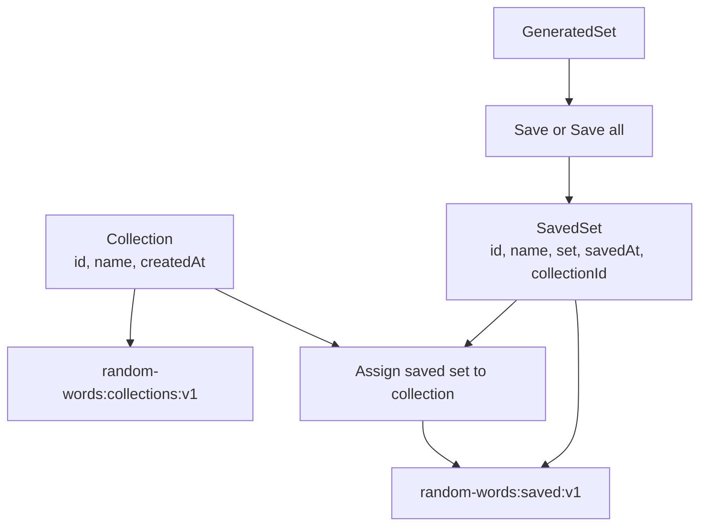

Saved sets contain a full `GeneratedSet`, not only word strings. Collections are lightweight labels assigned by `collectionId`.

Deleting a collection clears assignments to that collection but does not delete saved sets.

## Deployment Flow

Deployment is handled by GitHub Actions and GitHub Pages.

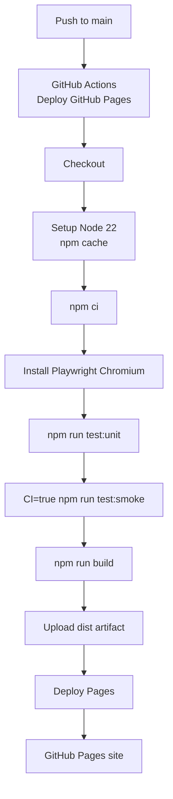

The workflow is defined in `.github/workflows/pages.yml`.

The build step runs after unit and smoke tests. This means the deployed artifact is only produced if the extracted service tests and browser-level tests pass.

`vite.config.ts` sets the Vite `base` path dynamically under GitHub Actions:

- Local development: `/`
- GitHub Pages: `/<repo-name>/`

## Testing And Verification

Fast service-level verification is handled by `npm run test:unit`, which runs Vitest against extracted pure logic such as share links, exports, and saved-library imports.

The primary browser workflow verification is `npm run test:smoke`, which runs Playwright tests against the app.

Current smoke coverage includes:

- Loading the SQLite database and rendering metadata
- Generating sets
- Saving sets
- Saved sets view
- Collections create and rename
- Help and settings dialogs
- POS filtering behavior
- Acronym filter visibility
- Semantic mode visibility
- Preset group visibility and preset-applied semantic behavior
- Share URL round trip
- Diagnostics export
- Generation warnings
- Definition fallback tooltips

Build verification is handled by `npm run build`, which performs preprocessing, WASM copying, TypeScript compilation, and Vite bundling.

Data quality verification is supported by `npm run audit:data`, which reads the generated SQLite database and reports targeted quality buckets.

## Runtime Error Boundaries And Failure Modes

The app currently handles major runtime failures through status messages rather than a full React error boundary.

Important failure cases:

- `words.sqlite.gz` and fallback `words.sqlite` cannot be loaded
- Datamuse semantic request fails
- Generation yields smaller sets because filters are too narrow
- Theme criteria produce no semantic matches or mostly fallback output
- Clipboard access is denied

The current behavior is pragmatic:

- Database load errors appear in the status area
- Generation errors appear in the status area
- Generation warnings appear in the generator and Diagnostics view
- Clipboard failures produce a toast-like notice
- Share-link clipboard failures still update the browser address bar

## Architectural Tradeoffs

### Static App Versus Backend

The static approach keeps hosting simple and cheap. It also means generated content and saved sets are private to the user's browser by default.

Tradeoff: any runtime semantic lookup must happen directly from the browser, and cross-device sync is not available.

### SQLite In Browser Versus JSON Word List

SQLite gives structured filtering, indexes, and a normalized artifact without requiring a server.

Tradeoff: the app must ship `sql.js` and the SQLite database asset.

### Build-Time Quality Scoring

Quality scoring at build time keeps runtime filtering fast and deterministic.

Tradeoff: improving quality requires updating curated metadata or preprocessing logic, then rebuilding the artifact.

### Datamuse Live Lookup

Datamuse gives flexible theme expansion without needing to ship a large semantic model.

Tradeoff: themed generation depends on network access, Datamuse availability, and Datamuse's lexical associations.

## Upgrade Hooks

The current architecture leaves clear extension points:

- Add new filter fields in `Filters`, `DEFAULT_FILTERS`, `queryWords`, `src/services/filterEvaluator.ts`, share-link validation, and export criteria.
- Add new semantic modes in `SemanticMode`, `MODE_LABELS`, `datamuse.ts`, and `generator.ts`.
- Add or reorganize theme presets in `THEME_PRESET_GROUPS`; each preset can apply theme text, semantic mode, and optional phrase behavior.
- Add new quality metadata in `data/quality/word-quality.json`, `scripts/write-runtime-safety.mjs` when it affects runtime safety lists, and `scripts/build-db.mjs`.
- Add new audit checks in `scripts/audit-db.mjs`.
- Add new saved-set organization behavior in `SavedSet`, `Collection`, and the saved/collection views.
- Add backend sync later without disturbing the local-first model by treating local storage as the offline cache.

## Glossary

- **Base pool:** the local SQLite query result for current criteria.
- **Semantic pool:** Datamuse results normalized into `WordEntry` objects.
- **Filtered pool size:** count of local database words after criteria filters, before semantic blending.
- **Quality score:** build-time score used to bias generation toward more useful words.
- **Quality mode:** runtime weighting curve applied to quality scores.
- **Frequency band:** build-time label used in scoring and exports.
- **Family key:** simplified root used to reduce near-duplicate word variants.
- **Share link:** URL containing encoded criteria, not generated results.
- **Saved set:** locally persisted generated set.
- **Collection:** locally persisted grouping label for saved sets.
